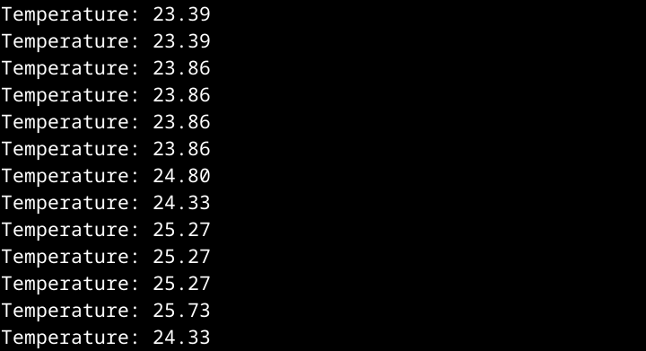

# Read Data from Temperature Sensor on Raspberry Pi Pico



## Prerequisites

Before diving into code, you need to **install prerequisites**. You can see it from [here](INSTALLATION.md)

## The Code

The code below initializes the internal temperature sensor and UART, prepares them for use. The while loop read data from sensor and write it to the UART once per seconds.

```c++
int main() {

    UART_Init();
    TEMPERATURE_Init();

    while (1) {

        uint8_t ui8TemperatureCelsius = TEMPERATURE_Read();

        UART_PutString(ui8TemperatureCelsius);
        UART_PutChar('\n');

        sleep_ms(1000);
    }

}
```

## Compiling The Code

To compile the source code we need to create a CMake file to automate the process. CMake files allow us to  easily build source files into one easy to use file.

Firstly we need to create folder that name is build.

```console
mkdir build
cd build
```

Then, we need to import essential pico-sdk-libraries

```console
cmake ..
```

Now, we can compile source files

```console
cd ..
cmake --build build
```

## Uploading The Code

Now that we compiled the code we can deploy to our microcontroller.

> **Note !:** To upload the compiled code, you need to start your Raspberry Pi Pico in **flash mode**. To start in flash mode you need to press **bootsel button** before plug in cable.

```console
cp build/main.uf2 <your-rasp-pi-pico-path>
```